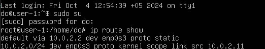
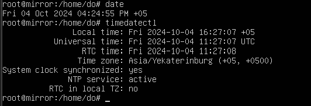
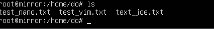
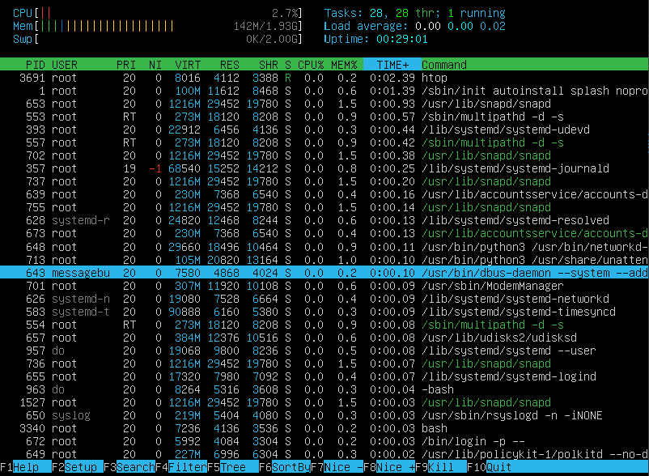

# Отчёт по DO01.

## Part 1. Установка ОС.

1. Скачал .iso образ системы с официального сайта Ubuntu.
2. Установил VM VirtualBox.
3. Создал и настроил новую виртуальную машину.
4. Запустил машину и прошл процесс стандартной установки.
5. Проверил версию Ubuntu через `cat /etc/issue`.

## Part 2. Создание пользователя.

1. Создал нового пользователя `user` и задал его основные параметры через `adduser`.

2. Добавил нового пользователя `user` в группу `adm` через `usermod`.

3. Проверил список всех пользователей через `cat /etc/passwd`.

Новый пользователь был успешно добавлен.

## Part 3. Настройка сети ОС.

1. Изменил имя машины через редактирование файлов `/etc/hostname` и `/etc/hosts` с помощью vim.

2. Установил свою временную зону через `timedatectl set-timezone`.

3. Вывел имена сетевых интерфейсов через `ls /sys/class/net`.

> Интерфейс `lo` (loopback) - это виртуальный сетевой интерфейс по умолчанию Linux. Является локальной петлей, имеющей IP-адрес 127.0.0.1. \
> Его используют для подключения приложений и процессов на одном компьютере к другим приложениям и процессам.

4. Получил IP-адрес от DHCP-сервера через `dhclient`.

> `DHCP` (Dynamic Host Configuration Protocol) - протокол прикладного уровня модели TCP/IP, служит для назначения IP-адреса клиенту. Это следует из его названия — Dynamic Host Configuration Protocol. IP-адрес можно назначать вручную каждому клиенту, то есть компьютеру в локальной сети. Но в больших сетях это очень трудозатратно, к тому же, чем больше локальная сеть, тем выше возрастает вероятность ошибки при настройке. Поэтому для автоматизации назначения IP был создан протокол DHCP.

5. Вывел внутренний и внешний IP-адрес интерфейса через `ip route` и `curl ifconfig.me`.

6.  Отключил получение IP-адреса по dhcp, задал статический IP-адрес и DNS-сервера в файле `/etc/netplan/*.yaml` и применил настройки через `netplan-apply`.

7. Перезагрузил систему и проверил, что настройки сохранились через `ip route show`.

8. Пропинговал хосты `1.1.1.1` и `ya.ru` через `ping`.

## Part 4. Обновление ОС.

1. Проверил обновления через `sudo do-release-upgrade -c`и Обновил пакеты через `apt upgrade`.

## Part 5. Использование команды sudo.

> Команда `sudo` (substitute user and do) позволяет подменить текущего пользователя на `root` и выполнять команды от имени суперпользователя с ведением протокола работы.

1. Дал новому пользователю права суперпользователя, путем добавления его в группу `sudo` через `usermod -aG sudo`. Проверил через команду `getent group sudo.`

2. Переключился на нового пользователя через `su`, затем проверил текущее название машины через `hostnamectl`, затем поменял имя машины через `hostnamectl set-hostname`.

## Part 6. Установка и настройка службы времени.

1. Вывел текущее время и дату через `date`.

2. Включил службу автоматической синхронизации времени через `timedatectl set-ntp true` и проверил успешность настройки службы `NTP`.

## Part 7. Установка и использование текстовых редакторов.

### Создание и сохранение файлов.

* **Vim**. Для редактирования нажать `I`, для выхода в режим команд `ESC`, для сохранения `SHIFT + : -> wq`.

* **Nano**. Для выхода нажать `CTRL + X`, затем `Y` для сохранения, и `ENTER` для подтверждения записи в файл.

* **Joe**. Для выхода нажать `CTRL + K`, а затем `W` для сохранения.

Проверяем все файлы

### Редактирование файлов без сохранения.

* **Vim**. Для выхода без изменений нажать `SHIFT + :`, а затем ввести `q!`.

* **Nano**. Для выхода без изменений нажать `CTRL + X`, а затем `N`.

* **Joe**. Для выхода без изменений нажать `CTRL + K`, потом ввести `Q`, а затем `N`.

### Поиск по содержимому файлов и замена слова.

* **Vim**. Для обычного поиска нажать `ESC` ввести `/` и слово.

* **Vim**. Для поиска с заменой `SHIFT + :`, а затем команду `%s/word_to_replace/replacement` и нажать `ENTER`.

* **Nano**. Для обычного поиска нажать `CTRL + W`, затем ввести слово.

* **Nano**. Для поиска с заменой нажать `CTRL + \`, затем ввести заменяемое слово и слово для замены. а потом подтвердить замену.

* **Joe**. Для обычного поиска нажать `CTRL + K -> F`, ввести искомое слово и нажать `Enter` (Важно, чтобы курсор находился перед искомым слово).

* **Joe**. Для поиска с заменой нажать `CTRL + K -> F`, ввести заменяемое слово, `ENTER`, выбрать `R`, ввести слово для замены, подтвердить `Y`.

## Part 8. Установка и базовая настройка сервиса SSHD.

1. Установил `SSH` через `apt install`.

2. Добавил службу `SSH` в автозагрузку через `systemctl enable` позже проверил работу через `systemctl status sshd`.

3. Открыл конфигурационный файл службы `SSHd` по пути `/etc/ssh/sshd_config` и поменял строку с портом на необходимую, а затем перезапустил службу через `systemctl restart`.

4. С помощью команды `ps -C` нашёл процесс по его имени.

**Ключи ps:**

-A, -e, (a) - выбрать все процессы;

-a - выбрать все процессы, кроме фоновых;

-d, (g) - выбрать все процессы, даже фоновые, кроме процессов сессий;

-N - выбрать все процессы кроме указанных;

-С - выбирать процессы по имени команды;

-G - выбрать процессы по ID группы;

-p, (p) - выбрать процессы PID;

--ppid - выбрать процессы по PID родительского процесса;

-s - выбрать процессы по ID сессии;

-t, (t) - выбрать процессы по tty;

-u, (U) - выбрать процессы пользователя.

5. Перезагрузил систему с помощью команды `reboot`.

6. Вывод команды `netstat -tan` содержит `tcp 0 0 0.0.0.0:2022 0.0.0.0:* LISTEN` согласно заданию
   

Где:

**netstat** - команда для вывода списка открытых портов и соответствующих им адресов, таблиц маршрутизации и скрытых соединений.

**Список ключей**:

-t - Отображение текущего подключения в состоянии переноса нагрузки с процессора на сетевой адаптер при передаче данных ( "offload" );

-a - Отображение всех подключений и ожидающих портов;

-n - Отображение адресов и номеров портов в числовом формате.

**Столбцы**:

Proto - Протокол, используемый сокетом.

Recv-Q - Счётчик байт не скопированных программой пользователя из этого сокета.

Send-Q - Счётчик байтов, не подтверждённых удалённым узлом.

Local Address - Адрес и номер порта локального конца сокета.

Если не указана опция --numeric (-n), адрес сокета преобразуется в каноническое имя узл (FQDN), и номер порта преобразуется в соответствующее имя службы.

Foreign Address - Адрес и номер порта удалённого конца сокета.
Аналогично "Local Address" State - Состояние сокета.

0.0.0.0 - это немаршрутизируемый адрес IPv4, который используется в качестве адреса по умолчанию или адреса-заполнителя.

## Part 9. Установка и использование утилит top, htop.

1. Запустил улититу `top`.

* **uptime** - 12 min;
* **authorized users** - 1 users;
* **load average** - 0.00 %;
* **total process** - 96 processes;
* **cpu load** - 0.0 us;
* **memory load** - 153.2 mb used;
* **pid process with most memory use** - 1 systemd (`m` для сортировки по загрузке памяти);
* **pid process with most cpu use** - 3337 kworker/0:0-events (`l` для сортировки по загрузке памяти)

2. Запустил утилиту `htop`.

* Сортировка по PID (`F6` и выбрать столбец для сортировки, или запускать `htop --sort-key` с нужным столбцом, или нажать M (большая буква), чтобы отсортировать процессы по использованию памяти).

* Сортировка по PERCENT_CPU (Можно нажать P (большая буква), чтобы отсортировать по использованию CPU).

* Сортировка по PERCENT_MEM.

* Сортировка по TIME.

* Фильтр для процесса sshd (`F4`, либо `/` и ввести название процесса).

* Поиск по процессу syslog (`F3` и ввести название процесса).

* Добавление вывода hostname, clock и uptime (`F2` и выбрать необходимые метрики и их расположение).

## Part 10. Использование утилиты fdisk.

### Запустил утилиту `fdisk -l`.

* **Название жесткого диска** - /dev/sda.
* **Размер** - 25 GiB.
* **Количество секторов** - 52428800 sectors.
* **Размер swap** - 0 MiB.

## Part 11. Использование утилиты df.

### Запустил команду `df`.

**Раздел / (`df /`, `df -h /` - для понятного вывода):**

`KiB - Кибибайты`

* **Размер раздел** - 11758760 KiB;
* **Размер занятого пространства** - 4966564 KiB;
* **Размер свободного пространства** - 6173088 KiB;
* **Процент использования** - 45%;
* **Единицы измерения** - кибибайт.

### Запустил команду `df -Th /`.

**Раздел / (`-T` - для вывода типа системы):**

* **Размер раздел** - 12 G;
* **Размер занятого пространства** - 4.8 G;
* **Размер свободного пространства** -  5.9 G;
* **Процент использования** - 45 %;

**Тип файловой системы корневого раздела - `ext4`**

## Part 12. Использование утилиты du.

* Запустил команду `du`.

* Вывел размер папок в `/home` в байтах (`-b`).

* Вывел размер папок в `/var` в байтах.

* Вывел размер папок в `/var/log` в байтах.

* Вывел размер папок в `/home` в человекочитаемом виде (`-h`).

* Вывел размер папок в `/var` в человекочитаемом виде.

* Вывел размер папок в `/var/log` в человекочитаемом виде.

* Вывел размер всего содержимого в `/var/log` (`*`).

## Part 13. Установка и использование утилиты ncdu.

1. Установил утилиту `ncdu`.

2. Вывел размер папок в `/home` (`ncdu /home`).

3. Вывел размер папок в `/var` (`ncdu /var`).

4. Вывел размер папок в `/var/log` (`ncdu /var/log`).

## Part 14. Работа с системными журналми.

1. Открыл логи `/var/log/dmesg` (содержит сообщения, полученные от ядра).

2. Открыл логи `/var/log/syslog` (содержит все системные сообщения).

3. Открыл логи `/var/log/auth.log` (содержит информацию об авторизации пользователей в системе).

   3. **Время последней успешной авторизации** - 4 октября, 17:32.
   3. **Имя пользователя** - do.
   3. **Метод входа в систему** - LOGIN.

4. Перезапустил службу `SSHd` через `systemctl restart` и проверил наличие этого факта в `/var/log/syslog`.

## Part 15. Использование планировщика заданий CRON.

1. Добавил запуск команды `uptime` через каждые 2 минуты (`*/2` означает каждые 2 минуты, а не каждую вторую минуту часа) с помощью `crontab -e`, и перенаправил её вывод в .log файл. Проверил список задач CRON через `crontab -l`..

2. Проверил выполнения команды `uptime` в созданном .log файле.

4. Проверил исполнение службы `cron` в логах.

5. Очистил список текущего пользователя задач через `crontab -r`.

##  АЛЛИЛУЙЯ, Наконец-то это закончилось!
 А там скоро еще второй проект делать....